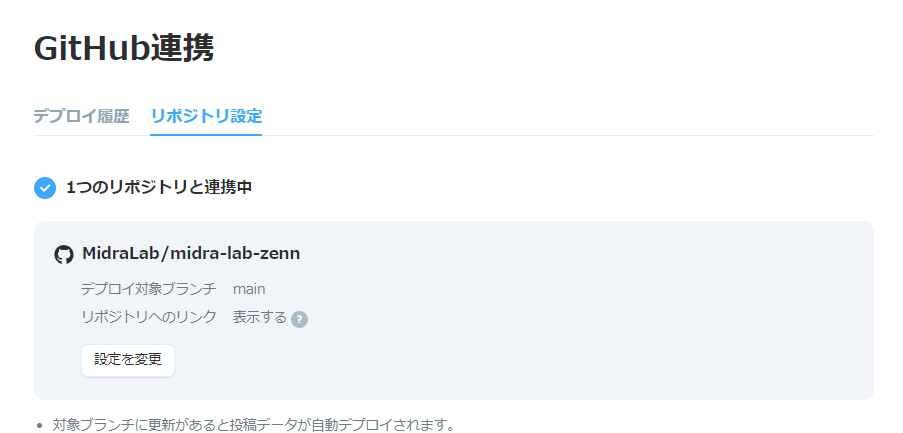

# midra-lab-zenn

MiraLab用のZennの記事作成ドキュメント

# 使い方

## 準備

1. [Zenn](https://zenn.dev/)のアカウントを作成する
2. 以下の画像のようにZennの[GitHub連携](https://zenn.dev/dashboard/deploys?tab=repo_settings)
   にて[midra-lab-zenn](https://github.com/MidraLab/midra-lab-zenn)との連携及びデプロイ対象ブランチを `main` に設定する

## 新規記事の作成

1. 記事を作成する用のブランチを新しく作成する(ブランチ名はなんでもOK)
2. ターミナル上で `docker exec midra-lab-zenn zenn new:article bash` を実行する
3. 作成された記事の headerに コミュニティと記事を紐づけをするために、 `publication_name: "midra_lab"` を追加する
4. `articles`内に新しく生成されたファイルに記事を書いていく

## 記事のPreview

1. ブラウザで http://localhost:8000/ にアクセスをする
2. 任意のページをクリックして、記事を確認する

## 記事の公開

1. 記事の作成が完了したら、`published:` を trueに変更する
2. リモートブランチにpushする
3. `main` branchにPRを出す
4. テストが通ったら自動で公開される

# 参考サイト

* [Zenn CLIで記事・本を管理する方法](https://zenn.dev/zenn/articles/zenn-cli-guide)
