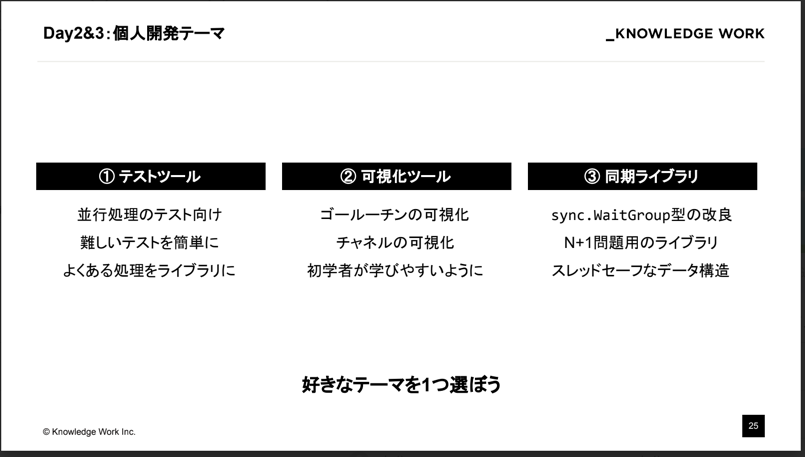

## はじめに
6/21 ~ 6/23の三日間でナレッジワークさんの**Enablement Internship for Gophers (3days)**に参加してきました。
今回はこれでやったことについてざっとまとめていきます！

## なぜ参加した？
理由として箇条書きでまとめていきます。
- ゴール―チンを動かしまくりたかった（笑）
- 将来的には大きなサービスを個人で作ってみたくその際にGoを使いたいと思っていたから
- 僕自身もOSSへのコミットを少しやっていて実際に自分がOSSパッケージを公開するとすればどのようなことが必要になるのか学びたかった
- 「イネーブルメント」という考え方が自分のやっている活動方針に近いと感じたから

## インターンシップについて
> ▼インターンシップ概要
〜Go上級者向け：バグのない並行処理の設計・実装編〜
ナレッジワークは、仕事におけるイネーブルメント(成果の創出や能力の向上)をテーマに、職種別に最適化されたソフトウェアを提供しています。
2022年12月には、プログラミング言語Goのスペシャリスト 上田拓也(@tenntenn)が入社し、エンジニアにもイネーブルメント活動を開始しています。
エンジニア向けイネーブルメント活動としてEnablement Internship for Gopherを開催します。
バグのない並行処理は非常に難易度が高いですが、メンターのサポートのもと、3日間で設計から実装まで身につけていただきます。

今回の参加者は15人で、バックグラウンドが様々な方がいて自己紹介時では自分より数十倍もレベルの高い方々がいて少し不安でした（笑）
3~4人で1チームとなり、チームごとにメンター１人がつくというような体制。
フルリモートで行われました。

## 1日目
### 流れ
- チーム内で自己紹介
- 講義
- チーム開発で制作するテーマを選択
- モブプログラミング開始(コードを書くドライバー1人に対して残りのメンバーがナビゲーターとなり開発する手法)

### 開発について
僕たちは以下のテーマで開発を始めました。

このテーマの肝は``Go1.21で導入されるcontext.AfterFunc関数を利用する``ところでした。
実際に検索してもそれに関するIssueや公式Referenceしか載っていなかったのでどのように使うのか
自分たちで考える必要がありました。最新機能でも[Github](https://github.com/search?q=context.AfterFunc&type=code)でその関数名を調べればOSSにして誰かが書いていることが多いのでそういうところからサンプルを探すという裏技もあります（笑）

#### context.AfterFuncについてまとめ
https://github.com/golang/go/issues/57928
https://pkg.go.dev/context@go1.21rc2#AfterFunc

### 2日目
#### 流れ
- 講義
- 個人開発で制作するツールテーマを選択
- 個人開発 ＆ メンター相談
#### 開発について
以下のテーマから開発するものを選択しました。

自分は**可視化ツールを選択しました**
この開発の肝は``どのようにruntime.Stackから情報を取り出しどのようにしてどのように視覚化させる``ところにあると考えました。
初めはリアルタイムでみられたらわかりやすそうだと考えましたがリアルタイムでレンダリングするパッケージを使わないと行けなさそうな感じで
このインターン期間で完成できそうじゃなかったのでとりあえずgoroutineやchannelがどのように動いたかの履歴が実行後に分かれば良いという結論になりそれを実現するツールの作成に取り掛かりました。
### 3日目
- 個人開発 ＆ メンター相談
- 成果発表
## 6/28振り返りイベントにて振り返りLTやりました
## 感想
一日目のモブプログラミングがなかなか難しいと感じました。ドライバーにとナビゲーターが共通の認識を持てるようにすり合わせるように何度も確認しながらなんとかできました。
今回のインターンでは最新版のGoを触り出たばかりの機能を使って開発を行っていくものでした。実際に検索してもそれに関するIssueや公式Referenceしか載っていなかったのでどのように使うのか
自分たちで考える必要がありました。最新機能でも[Github](https://github.com/search?q=context.AfterFunc&type=code)でその関数名を調べればOSSにして誰かが書いていることが多いのでそういうところからサンプルを探すという裏技もあります（笑）[おすすめの最速記事はこちら](https://github.com/snowmerak/snowmerak/blob/5b8d2a0e6f5aa654694fb22791792e09ffcb5f83/content/posts/019_context_ex.md?plain=1#L238)
